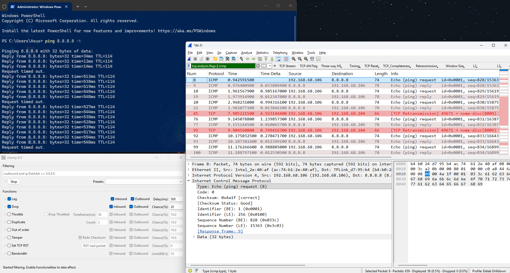
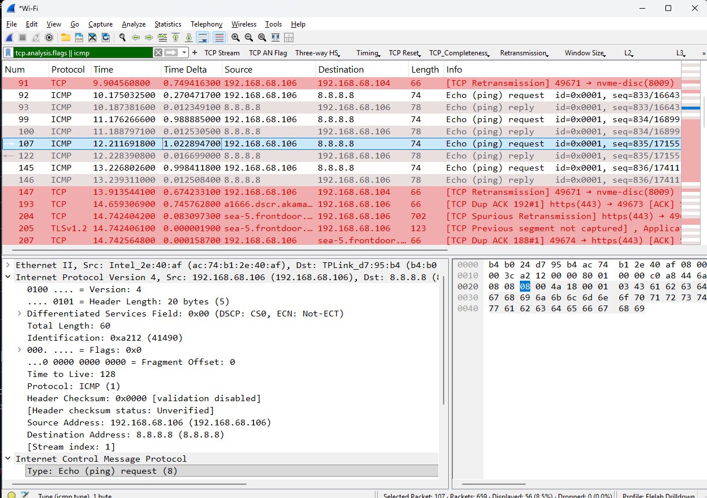

# Network Latency and Packet Loss Simulation

I wanted to see how a degraded network connection (like bad Wi-Fi) looks at the packet level. To do this, I used a tool called **Clumsy** to deliberately inject lag and drop packets into my connection while targeting a specific IP address.

## Simulation Steps

I opened **Clumsy** as an administrator and set the filter to `ip.DstAddr == 1.1.1.1` to ensure I only messed with my traffic going to Cloudflare.
2. I turned on **Lag** and set it to `500ms`, and enabled **Drop** with a `20%` chance. 
3. I started a live capture on **Wireshark** using the display filter `ip.addr == 1.1.1.1`.
4. From my terminal, I ran `ping 1.1.1.1 -t` to generate test traffic. I immediately saw some pings taking half a second while others timed out completely.

5. After the pings finished, I stopped the capture and turned off Clumsy.

---

## Analysis & Findings

When I looked at the Wireshark capture, the logs were practically screaming with **TCP Dup Ack** and **TCP Retransmission** flags. Here’s what was actually happening behind the scenes:

### 1. TCP Dup Ack (Duplicate Acknowledgment)
* **The Lowdown:** This happens when the receiver gets packets out of order (thanks to *Clumsy* dropping or delaying them).
* **What it looks like:** The receiver keeps reminding the sender, *"Hey, I'm missing something!"* by repeatedly asking for the last successful in-order packet it actually received.

### 2. TCP Retransmission
* **The Lowdown:** This is the sender realizing, *"Oops, looks like that packet didn't make it."*
* **What it looks like:** Once the sender gets hit with multiple **Dup Acks** (Fast Retransmit) or a **Timeout** (RTO), it resends the missing packet to make sure no data gets left behind. 

---

## Want to check out the capture?
If you want to dive into the data yourself, just open the `.pcapng` file in Wireshark and use these display filters:
* To spot the duplicate ACKs: `tcp.analysis.duplicate_ack`
* To spot the retransmissions: `tcp.analysis.retransmission`
