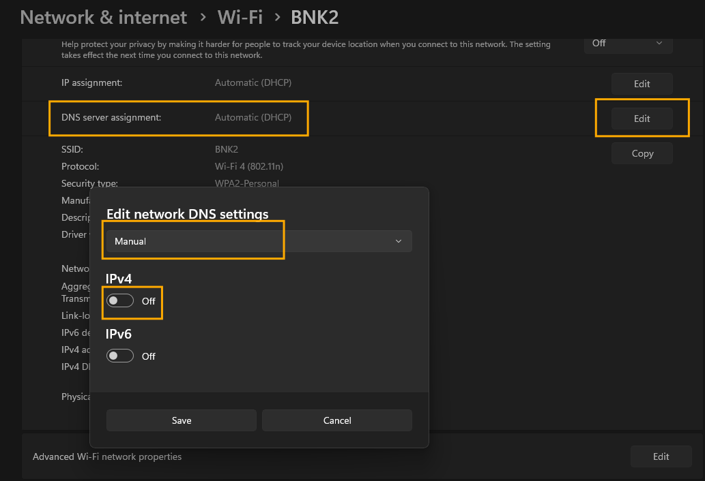
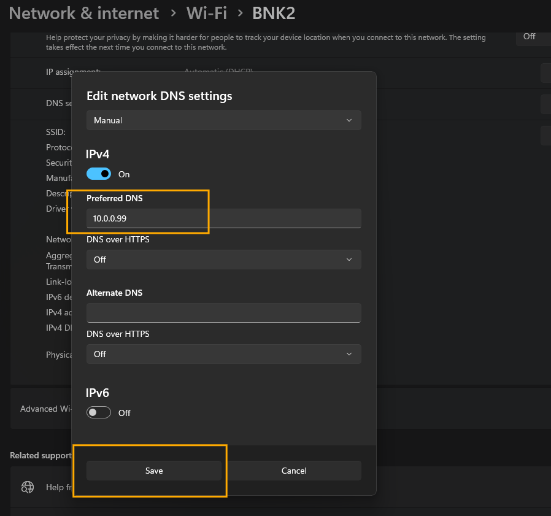
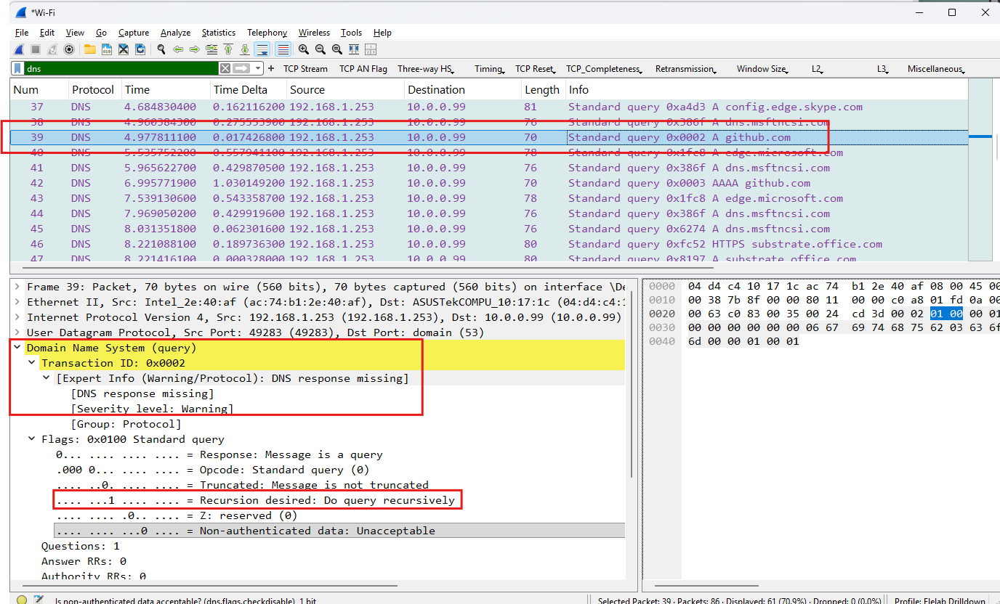

## 2. Simulating DNS Resolution Failure

### Scenario Overview
In this scenario, I simulated a DNS failure, which is a common network issue where client machines cannot resolve domain names into IP addresses.

### Simulation Steps
1. I manually broke the DNS configuration on Windows 11 using the following steps:
   * Opened **Settings** > **Network & internet** > **Wi-Fi** (or Ethernet).
   * Clicked on the network properties and found **DNS server assignment**, then clicked **Edit**.

     

   * Changed it from **Automatic (DHCP)** to **Manual**, toggled on **IPv4**, and set the Preferred DNS to a fake, non-existent IP address (`10.0.0.99`), then clicked **Save**.
  
     

2. I executed `ipconfig /flushdns` in the command prompt to clear the local resolver cache and force the OS to request fresh resolution.
3. I started a **Wireshark** capture and attempted to query a domain using `nslookup github.com`.

      
  
4. After capturing the failing packets, I reverted my network adapter back to Automatic (DHCP).

### Wireshark Analysis & Filters
To isolate the DNS traffic and analyze the failure pattern, I applied this display filter:
```dns```

**What I observed in the PCAP:**
* **Standard Queries with No Responses:** Wireshark showed `Standard query 0x... A github.com` outbound packets leaving my machine, but they were met with absolute silence.

    

* **Retries and Timeouts:** The operating system attempted to resend the exact same DNS query multiple times at increasing intervals before finally giving up and throwing a timeout error to the user interface.

    
