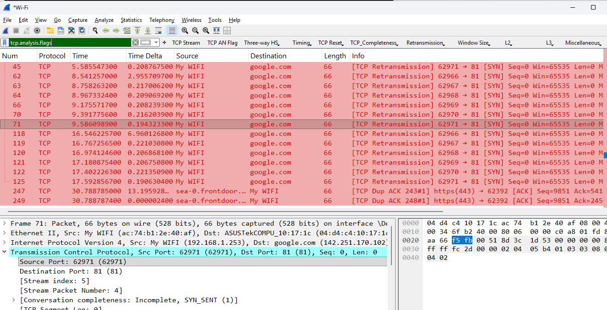
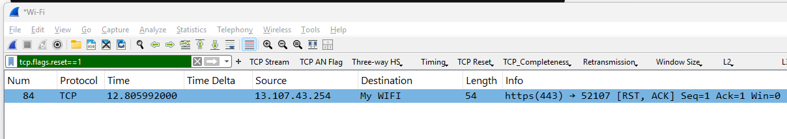

## 3. Simulating TCP Connection Reset (RST) vs. Silent Drops

### Scenario Overview
In this scenario, I analyzed how endpoints handle unavailable ports. I observed two distinct behaviors: a **Silent Drop** (where the server ignores the request, forcing retransmissions) and an active **TCP Reset** (where a remote firewall or server explicitly terminates the connection attempt).

### Simulation Steps
1. I initiated a Wireshark capture on my active network interface.
2. I attempted to force a TCP connection to a public destination on an unmonitored port (`81`) using the command prompt:
   ```PowerShell
    curl [http://google.com:81](http://google.com:81)
3. I also captured background traffic from active applications interacting with external cloud services (such as Microsoft/Live endpoints).


### Wireshark Analysis & Filters
To separate these behaviors, I used specific display filters:

* To see the silent timeout and retransmissions: (`tcp.analysis.flags`)
* To isolate the active reset flag: (`tcp.flags.reset == 1`)

What I observed in the PCAP:

Silent Drops (google.com:81): Google's edge completely ignored my SYN packets. This resulted in a flood of bright red [TCP Retransmission] packets as my machine kept desperately trying to establish a connection with no response.

  

Active TCP Reset (13.107.43.254): Unlike the silent drop on port 81, a background connection to a Microsoft service IP (13.107.43.254) was actively rejected. The remote host immediately answered with an [RST, ACK] flag, visibly cutting off the connection and forcing an immediate socket closure.

  


