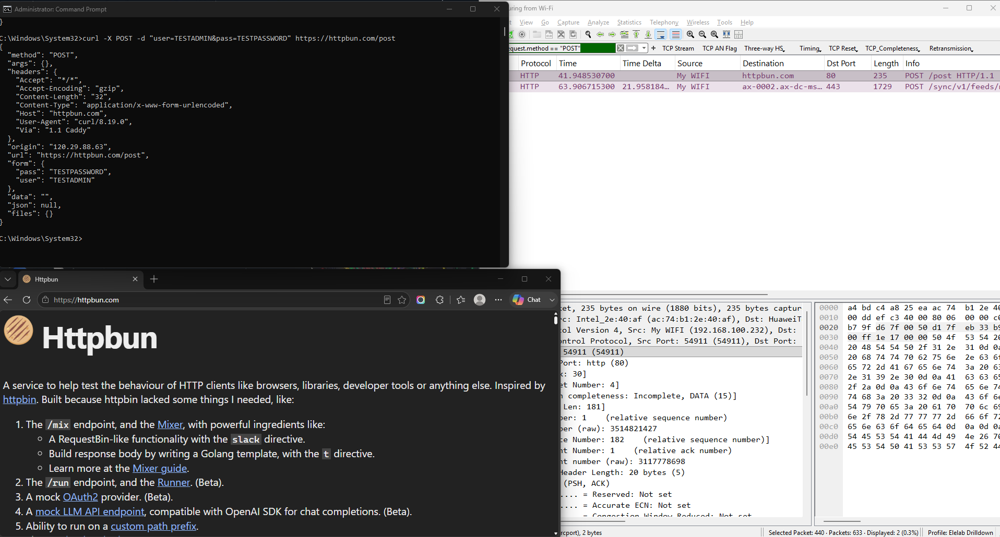
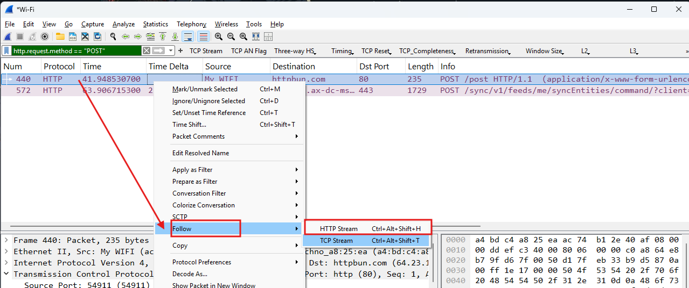
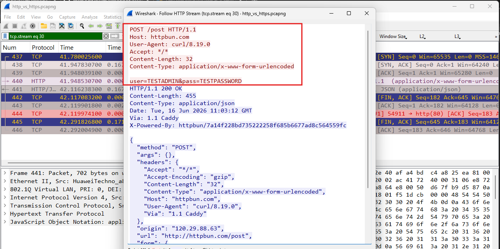
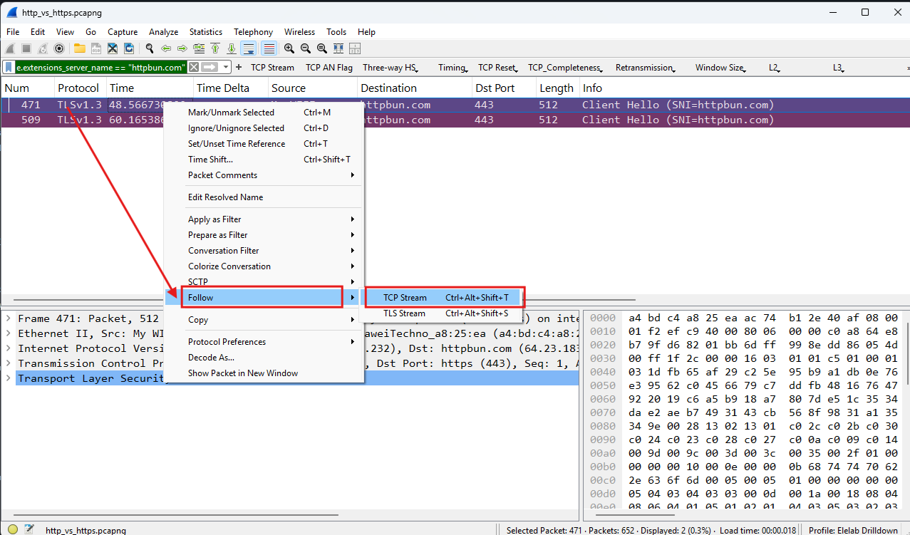
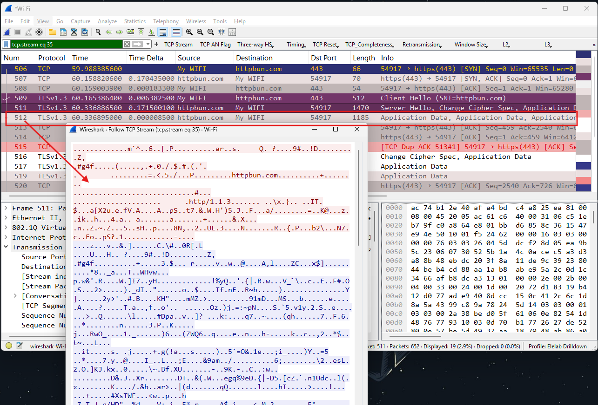

HTTP vs. HTTPS (Clear Text Data Leak)

### Scenario Overview
For this last scenario, I wanted to see first-hand why everyone keeps insisting on using HTTPS everywhere. I simulated a mock login request over a regular HTTP connection to see if I could "sniff" my own password using Wireshark, and then compared it to an encrypted HTTPS connection.

---

### Simulation Steps
1. I fired up Wireshark and started capturing traffic on my Wi-Fi interface.
2. Since most of the web is already encrypted, I used an API testing tool called **httpbun.com** to send a mock login payload over a plain, unencrypted HTTP link using `curl`:
   ```cmd
   curl -X POST -d "user=TESTADMIN&pass=TESTPASSWORD" http://httpbun.com/post


   
3. To see the difference, I ran the exact same command right after, but changed the URL to the secure version: `https://httpbun.com/post`
4. I stopped the capture to check out what Wireshark recorded.

---

### Wireshark Analysis & Filters

* `http.request.method == "POST"` (to find my HTTP login attempt)

**What I learned from the PCAP:**
* **HTTP is a massive data leak risk:** After applying the `http.request.method == "POST"` filter, I selected the specific packet where the destination port was **80** (the standard port for unencrypted HTTP traffic). I right-clicked it, went to **Follow > TCP Stream**, and it opened up a new window.



Right then and there, you can clearly see the **unencrypted username and password** (`user=TESTADMIN&pass=TESTPASSWORD`) in plain text! It really opened my eyes to how easy it is for someone to harvest data if you're browsing on a public Wi-Fi network without encryption.



---

* `tls.record.content_type == 23` (to isolate the encrypted payload)
* `tls.handshake.extensions_server_name == "httpbun.com"` (alternative domain handshake filter)

* **HTTPS completely saves the day:** For the HTTPS side, I used the filter `tls.handshake.extensions_server_name == "httpbun.com"`, because it isolates the initial handshake where my computer explicitly asks to talk to `httpbun.com`. Alternatively, using `tls.record.content_type == 23` if I wanted to skip all the setup packets (like Client Hello and Server Hello) and see only the packets carrying the actual encrypted data/payload.



No matter which filter I used to find it, following that secure stream gave me nothing but unreadable, garbled characters—proving the password remained completely secure during transit.


